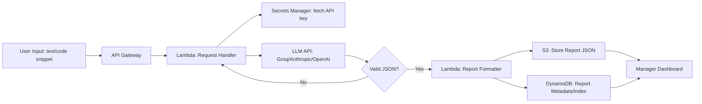

# Task 2: Business Analysis & Process Mapping

## User Story 1 - Submitting content for audit

**Title:** As a manager, I want to submit a document or code snippet for audit so I can
get a plain-language summary of risks without needing engineering help.

```gherkin
Feature: Submit content for audit

  Scenario: Manager submits a valid text snippet
    Given the manager is logged into the Audit Tool dashboard
    And they have a text or code snippet ready to paste or upload
    When they submit the content via the "New Audit" form
    Then the system should display a "Processing..." status
    And within 30 seconds return a report containing a summary,
      a list of identified issues with severity levels, and recommended fixes

  Scenario: Manager submits empty or invalid content
    Given the manager is on the "New Audit" form
    When they attempt to submit with no content in the input field
    Then the system should display an inline validation error
    And should not trigger an API call
```

## User Story 2 - Reviewing and acting on a report

**Title:** As a manager, I want to view past audit reports and filter by severity so I
can prioritize which issues to escalate to the engineering team.

```gherkin
Feature: Review audit reports

  Scenario: Manager filters reports by high severity
    Given the manager has at least one completed audit report
    When they open the "Reports" dashboard
    And select the filter "Severity: High"
    Then only issues tagged "High" severity should be displayed
    And each issue should show its type, description, and recommended fix

  Scenario: Audit fails due to an upstream API error
    Given the manager has submitted content for audit
    When the LLM API call fails or times out after retries
    Then the system should display a clear error message
    And should log the failure for engineering follow-up
    And should not show a blank or partially-rendered report
```

## Data Flow



**Text version:**

1. **User Input** - manager pastes text/code into the frontend.
2. **API Gateway** - receives the request, handles auth/throttling.
3. **Lambda (Request Handler)** - pulls the LLM API key from Secrets Manager, calls the LLM.
4. **Validation loop** - if the JSON response is malformed, retry before failing.
5. **Lambda (Report Formatter)** - normalizes the validated JSON into the final report shape.
6. **Storage** - report body goes to S3; searchable metadata goes to DynamoDB.
7. **Dashboard** - manager views/filters reports pulled from DynamoDB + S3.
