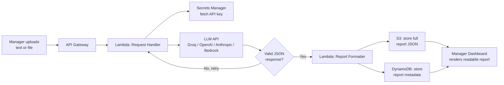

# Task 2: Business Analysis & Process Mapping

## User Story 1 - Submitting content for audit

**As a** non-technical manager,
**I want to** submit a document or code snippet through a simple upload form,
**so that** I can get a plain-language risk summary without needing to understand
code or involve an engineer for a first pass.

```gherkin
Feature: Submit content for audit

  Scenario: Manager submits a valid document or snippet
    Given the manager is logged into the Audit Tool dashboard
    And they have a file or pasted text ready to submit
    When they click "New Audit" and submit the content
    Then the system displays a "Processing..." status
    And within 30 seconds shows a plain-language report with a summary,
      a color-coded list of issues by severity, and suggested next steps

  Scenario: Manager submits an empty or unsupported file
    Given the manager is on the "New Audit" form
    When they try to submit with no content, or an unsupported file type
    Then the system shows a clear, non-technical message
      (e.g. "Please add some text or upload a supported file")
    And no request is sent to the audit engine
```

*Note: the manager never interacts with raw JSON directly. The dashboard renders
the structured API output (see Task 1's schema) as a readable report - a
plain-English summary at the top, issues grouped and color-coded by severity
(red/amber/green for High/Medium/Low), and fixes written as short action items.*

## User Story 2 - Reviewing and prioritizing past reports

**As a** non-technical manager,
**I want to** browse past audit reports and filter them by severity,
**so that** I can quickly decide which issues to escalate to the engineering
team without having to read every report in full.

```gherkin
Feature: Review and prioritize audit reports

  Scenario: Manager filters reports by high severity
    Given the manager has at least one completed audit report
    When they open the "Reports" dashboard
    And select the filter "High severity only"
    Then only issues marked High severity are shown
    And each one displays its plain-language description and suggested fix
    And the manager can click "Escalate" to notify the engineering team directly

  Scenario: The audit fails partway through
    Given the manager has submitted content for audit
    When the underlying AI service fails or times out after retries
    Then the manager sees a friendly error message, not a technical stack trace
    And the failure is logged for the engineering team to investigate
    And the manager is not shown a blank or partially-completed report
```

## Data Flow



**Plain-text version:**

1. **Manager submits input** - text pasted or a file uploaded through the dashboard.
2. **API Gateway** - receives the request, applies auth and rate limiting.
3. **Lambda (Request Handler)** - retrieves the LLM API key from Secrets Manager,
   sends the content to the LLM, and validates the JSON response.
4. **Validation loop** - if the response is malformed, the handler retries
   automatically (see Task 1's error handling) before giving up gracefully.
5. **Lambda (Report Formatter)** - converts the validated JSON into the final
   report shape used by the dashboard.
6. **Storage** - the full report is saved to S3; lightweight searchable metadata
   (timestamp, submitter, severity counts) is saved to DynamoDB.
7. **Dashboard** - the manager views a rendered, plain-language report pulled
   from DynamoDB (for the list/filter view) and S3 (for the full report detail).