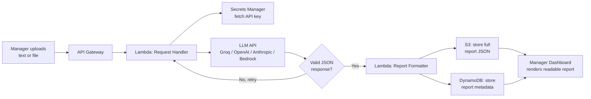

# Task 2: Business Analysis & Process Mapping

## User Story 1 - Submitting content for audit

**As a** non-technical manager,
**I want to** upload a file or paste code/text into the audit tool,
**so that** I can get a plain-language summary of risks without needing to
read or understand the code myself.

```gherkin
Feature: Submit content for audit

  Scenario: Manager submits code for review
    Given the manager is logged into the Audit Tool dashboard
    When they click "Upload", select a file or paste in text, and click "Submit"
    Then they see a progress bar showing "Uploading... Analyzing... Done"
    And once complete, they see a plain-English summary plus a color-coded
      list of issues (red, yellow, or green depending on severity)

  Scenario: Manager submits with nothing entered
    Given the manager is on the "New Audit" screen
    When they click "Submit" without uploading a file or pasting any text
    Then they see a simple message asking them to add content first
    And no request is sent to the audit engine
```

## User Story 2 - Reviewing and escalating issues

**As a** non-technical manager,
**I want to** see past audit reports and filter them by how serious the
issues are,
**so that** I can quickly decide what to send to the engineering team
without reading every report in full.

```gherkin
Feature: Review and escalate audit reports

  Scenario: Manager filters reports by high severity
    Given the manager has at least one completed audit report
    When they open the "Reports" screen and select "High severity only"
    Then only the high-severity issues are shown, each with a plain-English
      description and a suggested fix
    And the manager can click "Escalate" to notify the engineering team

  Scenario: The audit fails
    Given the manager has submitted content for audit
    When the analysis fails or times out after the system retries
    Then the manager sees a simple, friendly error message - not a technical
      error
    And the failure is logged for the engineering team to look into
```

## Data Flow



**Plain-text version:**

1. **Manager submits input** - a file or pasted text through the dashboard.
2. **API Gateway** - receives the request and applies auth/rate limiting.
3. **Lambda (Request Handler)** - fetches the LLM API key from Secrets
   Manager, sends the content to the LLM, and checks the response is valid
   JSON.
4. **Retry if needed** - if the response is malformed, it retries
   automatically before giving up gracefully (see Task 1).
5. **Lambda (Report Formatter)** - turns the validated result into the final
   report shape.
6. **Storage** - the full report goes to S3; searchable metadata (timestamp,
   submitter, severity counts) goes to DynamoDB.
7. **Dashboard** - the manager sees the finished report, rendered as plain
   language rather than raw JSON.